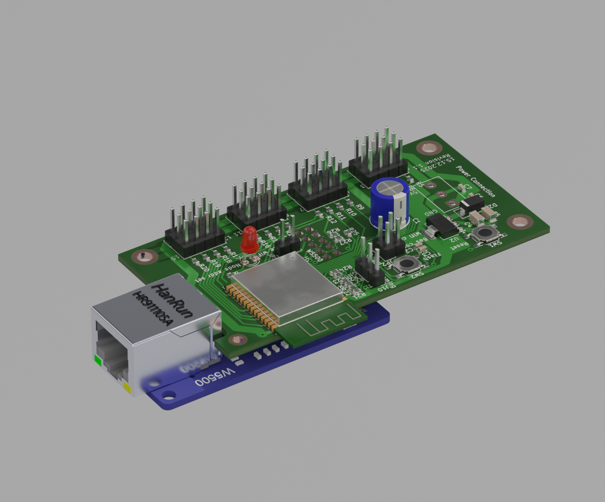

## Network device to drive Servos for Animatronics:

With the latest Software 3.0 the Bechele software (https://github.com/bechele/bechele) now supports beside the existing PCA9685 PWM Boards also network devices, based on cheap ESP32 modules. Each network device may handle 16 Servos or 16 Relais or a desired mixture of both. All the data transfers from the Host (Raspi) is realized using broadcast transmissions, where all devices (nodes) receive the same data packets. According to the node configuration, the node takes the data from the packet that is intended for it. This way there is plenty of time to drive 700 Servos @ 44 ESP32 nodes, or 11000 relais @ 700 nodes with a 50ms refresh rate. Network devices may be connected via Ethernet or WiFi. Of course Ethernet driven nodes are more stable than via Wifi. The board exists in two flavours. A smaller SMD version and a larger version unsing conventional parts. For both versions you may download the gerber files and also the kicad source, so you can order a PCB from your desired PCB manufacturer. The smd version is for skilled people who know how to handle and solder SMD parts. The conventional Version uses mainly larger parts that are much easier to solder onto the PCB. Which one you use is up to you. The function is identical.  
**Note: Using Wifi is by far not as safe as using ethernet. To use WiFi, you need to make sure, the WiFi router is very close to the network devices, since the RSSI (Received Signal Strength Indicator) must be below 70 dB, (you may read the RSSI value during boot, when connecting a serial monitor to the TX pin of the device). Otherwise you will notice lots of missing packets – means the movement of your servos will be not continuous. Also you need an environment where there are only few other Wifi radio sources. If there is a lot of other traffic around, you will encounter the same problems. This is due to the working principle of WiFi and has nothing to do with the software. Wifi is not intended for real time control of devices ! So my recommendation is to use W5500 Ethernet modules. In a test using Ethernet with 700 configured Servos @ 50 ms refresh rate (means every 50 ms all servos got new data), none of the packets went lost over a longer time, so ethernet is quite safe.**

